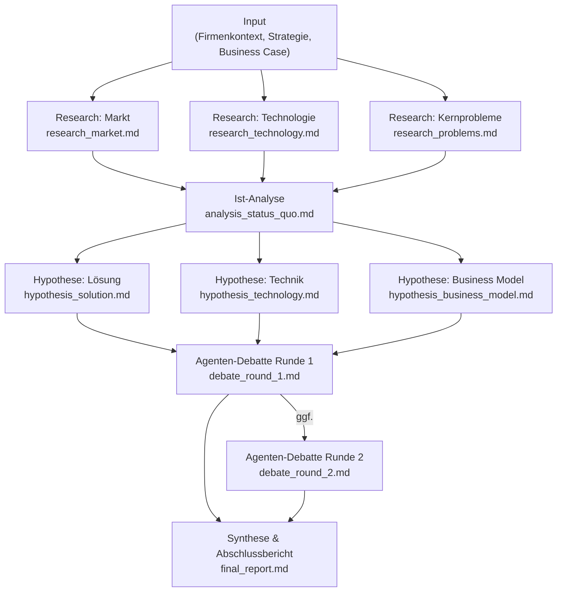

# Eval — Business Case Research & Analysis System

## Ziel

Ein mehrstufiges, agentenbasiertes System zur tiefen Analyse von Business Cases. Es kombiniert parallele Forschung aus mehreren Blickwinkeln, strukturierte Synthese, Debattierrunden zwischen Agenten mit unterschiedlichen Perspektiven, und eine vollständige Dokumentation aller Zwischenschritte.

### Übergeordnetes Designziel: Halluzinationen minimieren

Das System soll demonstrieren, dass eine **kleinschrittige Aufgabenzerteilung mit vollem Fokus auf die jeweils aktuelle Teilaufgabe** Halluzinationen minimiert — insbesondere bei technischen Details. Die Kernhypothese:

> Je enger der Kontext einer Teilaufgabe, desto weniger muss ein Modell "erfinden". Research-Agenten suchen erst, dann schreiben sie. Hypothesen-Agenten bauen auf verifizierten Research-Outputs auf. Kein Agent muss gleichzeitig alles wissen.

Das System ist damit auch ein **Proof of Concept für qualitätsorientierte Agenten-Architektur**:
- Jede Teilaufgabe hat genau eine Verantwortung
- Kein Agent trifft Annahmen über Bereiche außerhalb seines Scopes
- Alle Quellen und Zwischenschritte sind nachvollziehbar in .md-Dateien dokumentiert
- Widersprüche werden in der Debatte explizit gemacht, nicht versteckt

---

## Eingabeparameter

| Parameter | Beschreibung |
|---|---|
| **Firmenkontext** | Wer sind wir? Stärken, Ressourcen, Team, Technologie-Stack |
| **Strategiekontext** | Wohin wollen wir? Positionierung, Werte, Zielrichtung |
| **Business Case** | Das zu untersuchende Thema inkl. grober Lösungsrichtung |

---

## Phase 1 — Tiefe Research (parallel)

Drei unabhängige Research-Winkel werden **gleichzeitig** bearbeitet:

### 1a) Markt studieren
- Marktgröße, Wachstum, Segmente
- Wettbewerber, Positionierungen, Differenzierungen
- Trends und Kräfte (Porter's Five Forces, PESTEL o.ä.)
- Zwischendokument: `research_market.md`

### 1b) Technologie studieren
- Verfügbare und aufkommende Technologien im relevanten Bereich
- Reifegrad, Kosten, Skalierbarkeit
- Make vs. Buy — welche Bausteine existieren bereits?
- Zwischendokument: `research_technology.md`

### 1c) Kernprobleme im Markt studieren
- Welche Probleme äußern Marktteilnehmer öffentlich?
- Pain Points aus Foren, Reviews, Interviews, Reports
- Priorisierung der Probleme nach Häufigkeit und Schwere
- Zwischendokument: `research_problems.md`

---

## Phase 2 — Ist-Analyse & Kontextualisierung

Die drei Research-Ergebnisse werden zusammengeführt und **im Hinblick auf den spezifischen Input** (Firmenkontext + Strategiekontext + Business Case) analysiert:

- Welche Marktchancen sind für uns relevant?
- Welche Technologien passen zu unseren Ressourcen?
- Welche Probleme adressiert unsere Lösungsrichtung — und welche nicht?
- Wo liegen Lücken, Risiken, blinde Flecken?

Zwischendokument: `analysis_status_quo.md`

---

## Phase 3 — Lösungshypothese (parallel + Debatte)

Drei Aspekte werden **gleichzeitig** ausgearbeitet:

### 3a) Konkrete Lösung in unserer Richtung
- Wie sieht die Lösung konzeptionell aus?
- Feature-Set, User Journey, Kernwertversprechen
- Zwischendokument: `hypothesis_solution.md`

### 3b) Technische Machbarkeit & Risiken
- Wie kann das Problem technisch gelöst werden?
- Architektur-Optionen, Build-Blöcke, Abhängigkeiten
- Höchste technische Risiken (Top 3–5)
- Zwischendokument: `hypothesis_technology.md`

### 3c) Vermarktbarkeit & Geschäftsmodell
- Intensive Analyse nach:
  - ICP (Ideal Customer Profile)
  - TAM / SAM / SOM
  - Preismodell-Optionen
  - Go-to-Market-Ansatz
  - Monetarisierungsstrategie
- Zwischendokument: `hypothesis_business_model.md`

---

## Phase 4 — Agenten-Debatte

Mindestens **eine Runde** (optional zwei) strukturierter Debate zwischen Agenten mit unterschiedlichen Rollen:

| Agent | Perspektive |
|---|---|
| **Optimist** | Betont Chancen, Stärken, Upside |
| **Kritiker** | Hinterfragt Annahmen, benennt Risiken |
| **Techniker** | Bewertet Machbarkeit und technische Risiken |
| **Marktexperte** | Bewertet Vermarktbarkeit und Wettbewerb |
| **Stratege** | Bewertet strategischen Fit mit Firmenkontext |

Jede Debattenrunde produziert:
- Kernaussagen je Agent
- Widersprüche und Einigungspunkte
- Gewichtete Schlussfolgerungen

Zwischendokument: `debate_round_1.md` (ggf. `debate_round_2.md`)

---

## Phase 5 — Synthese & Abschlussbericht

Alle Zwischendokumente werden zu einem finalen Report zusammengefasst:

- Executive Summary
- Stärken & Schwächen der Lösungsrichtung
- Empfehlung: Go / No-Go / Pivot-Optionen
- Offene Fragen und nächste Schritte

Finaldokument: `final_report.md`

---

## Randbedingungen (Systemdesign)

| # | Bedingung |
|---|---|
| **i** | Aufgaben werden so weit wie möglich in Unteraufgaben heruntergebrochen |
| **ii** | Aufgaben werden so weit wie möglich parallelisiert |
| **iii** | Agenten mit unterschiedlichen Sichtweisen debattieren die Lösung in mindestens einer Runde (ggf. zwei) |
| **iv** | Alle Zwischenschritte werden in eigenen Markdown-Dateien dokumentiert |
| **v** | Der gesamte Flow wird am Ende als Mermaid-Diagramm visualisiert und diskutiert |

---

## Mermaid Flow (Zielzustand — wird am Ende verfeinert)

---

## Offene Fragen für die Planungsphase

1. Welches Modell / Framework soll die Agenten antreiben? (Claude API, LangGraph, eigenes Orchestrierungsskript?)
2. Wie wird Research konkret durchgeführt? (Web Search, RAG, manuelle Dokumente?)
3. Soll das System interaktiv (CLI / UI) oder vollautomatisch laufen?
4. Wie wird der Input strukturiert übergeben? (YAML, Formular, freier Text?)
5. Welche Sprache / Laufzeitumgebung? (Python, TypeScript, andere?)
