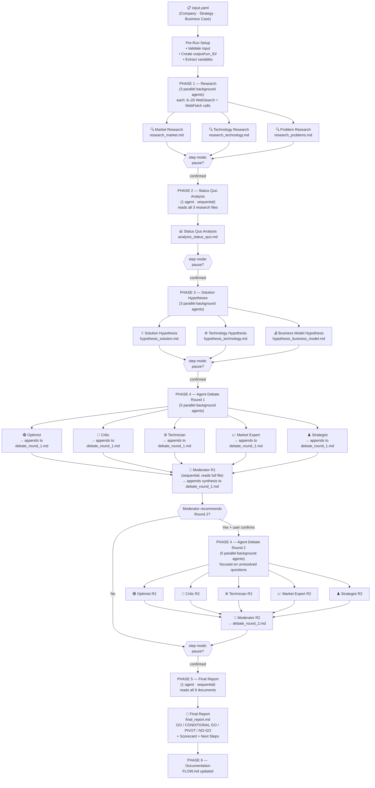

# EVAL System — Flow Diagram



---

## Parallelization Summary

| Phase | Parallel agents | Sequential agents | Notes |
|---|---|---|---|
| Phase 1 | 3 (market, tech, problems) | — | Background; each runs 6–26 searches |
| Phase 2 | — | 1 (status quo analysis) | Reads all 3 research files |
| Phase 3 | 3 (solution, tech, business) | — | Background; reads research + analysis |
| Phase 4 R1 | 5 (debate personas) | 1 (moderator) | Personas append to shared file |
| Phase 4 R2 | 5 (debate personas) | 1 (moderator) | Optional; triggered by Moderator R1 |
| Phase 5 | — | 1 (synthesis) | Reads all 9 intermediate files |

**Total agents per run:**
- 1-round debate: **13 agents**
- 2-round debate: **20 agents**

**Parallel launch points:** 4 (Phases 1, 3, 4 R1 personas, 4 R2 personas)

**Step mode pause points:** After Phases 1, 2, 3, and 4 (before Phase 5)

---

## Output Files per Run

```
output/run_YYYYMMDD_HHMMSS/
├── research_market.md            Phase 1
├── research_technology.md        Phase 1
├── research_problems.md          Phase 1
├── analysis_status_quo.md        Phase 2
├── hypothesis_solution.md        Phase 3
├── hypothesis_technology.md      Phase 3
├── hypothesis_business_model.md  Phase 3
├── debate_round_1.md             Phase 4 R1 (5 personas + moderator appended sequentially)
├── debate_round_2.md             Phase 4 R2 (optional — same structure, focused)
└── final_report.md               Phase 5
```

---

## Architecture Notes (from the NeoEmployee run — see `results/neoemployee/`)

**Shared-file append pattern:** All 5 debate personas write to a single file by appending. This works reliably but requires the file to be pre-created with a header before agents are launched. The moderator runs sequentially *after* all personas complete (waiting for all task notifications).

**Research depth:** `deep` mode agents typically perform 20–26 searches (not just 6) when allowed to follow leads. The 6-search minimum is a floor, not a ceiling.

**WebSearch permissions:** Subagents require `WebSearch` and `WebFetch` in the `permissions.allow` array of `~/.claude/settings.json`. Without this, Phase 1 agents silently fail on search calls. Verify before starting a run.

**Round 2 focus:** When the Moderator recommends Round 2, it identifies specific unresolved questions. Round 2 agents should be given those exact questions as their sole focus — not a full repeat of Round 1. This produces sharper, faster convergence.

**ICP precision matters commercially:** This run surfaced that a 1–2 hires/year difference in the ICP qualification threshold (30 vs. 35) changes a below-break-even ROI to above-break-even. Future runs should instrument the commercial analysis with explicit break-even calculations, not just directional sizing.
