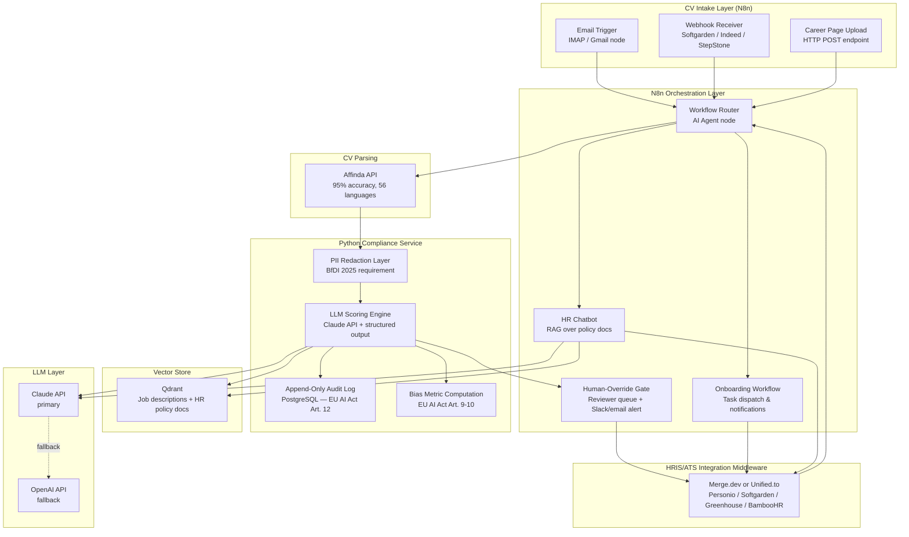

# Technology Hypothesis — NeoEmployee HR AI
> Based on: research_technology.md, analysis_status_quo.md
> Date: 2026-03-21

---

## 1. Architecture Options

### Option A: N8n-Native Orchestration with LLM Screening Layer

**Summary:** End-to-end solution built primarily inside N8n, using its native AI Agent nodes (available since 2024) for LLM calls, with third-party CV parsing via API and a unified HRIS middleware for integrations. Python is used only for lightweight scoring logic callable as a sub-process or HTTP endpoint.

**Core components:**
- N8n AI Agent nodes (Claude API / OpenAI API) for CV evaluation, ranking, onboarding task routing, and chatbot dialogue management
- Affinda or Eden AI CV parsing API called as an HTTP node within N8n workflows
- Merge.dev or Unified.to as the abstraction layer for Personio / Softgarden / Greenhouse — replaces per-ATS custom node builds
- A vector store (Qdrant or Pinecone, both have N8n community integrations) for RAG over policy documents and job descriptions
- Pre-ATS ingestion: N8n email-trigger node (IMAP/Gmail) for catching CV attachments before they enter the HRIS, plus a webhook receiver for job board forwards (Softgarden, Indeed)
- Postgres or a lightweight document store (Supabase or equivalent) for audit log persistence
- An N8n sub-workflow as the human-override gate: every scoring output writes to a reviewer queue before any candidate status change fires

**Technology choices:** N8n (orchestration + AI agent), Claude API (primary LLM), Affinda (CV parsing), Merge.dev or Unified.to (HRIS/ATS abstraction), Qdrant (vector DB), Supabase (audit log + state)

**Pros:**
- Directly leverages NeoEmployee's existing N8n expertise — lowest time to first working prototype
- N8n AI Agent node explicitly supports Claude, OpenAI, LangChain, and vector DBs (confirmed in research_technology.md §5)
- Community HR templates exist (CV processing, Personio webhooks) — reduces ground-up build effort
- Visual workflow editor makes the logic auditable by non-engineers — valuable for EU AI Act Annex IV documentation
- No new runtime environments to maintain at the start; all logic lives in N8n workflows
- Pre-ATS email ingestion sidesteps the confirmed Personio Recruiting API v2 CV file gap entirely

**Cons:**
- N8n workflows can become complex to version-control and test systematically at scale; no native unit-test framework
- Scoring/ranking logic requiring custom statistical operations (bias metrics, calibration checks) is awkward to express in N8n — requires external HTTP calls to Python anyway
- N8n's execution model is not optimized for high-throughput batch processing (e.g., 200 CVs arriving overnight); long-running workflows can hit timeout limits
- EU AI Act audit trail tamper-resistance cannot be guaranteed solely by N8n's internal execution log — requires external immutable log sink
- Scaling beyond ~5 concurrent customer deployments may require N8n Enterprise licensing (cost increase)

---

### Option B: Python Microservice Backend + N8n for Workflow Triggers Only

**Summary:** Core intelligence (CV parsing pipeline, LLM scoring, RAG engine, audit logging) lives in a Python service layer. N8n is reduced to a trigger/router role: receiving webhooks and emails, calling the Python API endpoints, and handling human-in-the-loop notification flows (Slack alerts, email approvals).

**Core components:**
- Python FastAPI service exposing internal REST endpoints: `/parse`, `/score`, `/rank`, `/chat`, `/audit`
- Affinda or Textkernel for CV parsing (called from Python, not N8n)
- LangChain or LlamaIndex for RAG pipeline construction (HR policy chatbot, job description context injection)
- Qdrant or FAISS for vector storage and similarity search
- Claude API (primary) + OpenAI API (fallback) for LLM inference
- Merge.dev or Unified.to for HRIS/ATS connector abstraction (called from Python service)
- N8n handles: inbound email triggers, Softgarden/Greenhouse webhooks, approval notifications, onboarding task dispatch
- PostgreSQL for audit log with append-only write pattern (immutable log pattern for EU AI Act Art. 12)
- Docker containers deployable to any EU-region cloud (AWS eu-central-1, Azure germanywestcentral)

**Technology choices:** Python/FastAPI (core service), LangChain/LlamaIndex (RAG), Claude API + OpenAI API (LLM), Affinda/Textkernel (CV parsing), Qdrant (vector DB), N8n (trigger layer), Merge.dev (HRIS abstraction), PostgreSQL (audit log), Docker/EU cloud (deployment)

**Pros:**
- Full control over scoring logic, bias auditing, and calibration — needed for EU AI Act risk management (Art. 9–10)
- Python ecosystem gives access to the full AI/ML toolchain: embeddings, reranking, statistical tests
- Much better testability: unit tests, integration tests, CI/CD pipelines are standard Python practice
- Cleaner architecture for multi-tenant SaaS evolution (each customer's data isolated at the service layer)
- Tamper-resistant audit log is straightforward in PostgreSQL with append-only tables
- LangChain/LlamaIndex are the documented production patterns for RAG in HR AI (confirmed in research_technology.md §5)
- Scales horizontally; N8n does not carry the compute burden

**Cons:**
- Significantly higher initial build effort — NeoEmployee must staff or hire Python backend engineers comfortable with FastAPI and LangChain
- Two systems to operate, monitor, and debug: N8n + the Python service; more DevOps overhead for a 14-person team
- NeoEmployee's current competitive advantage is N8n fluency; this architecture shifts the center of gravity to Python microservices, which may not be their current strength
- Longer time to a demo-ready prototype

---

### Option C: Hybrid Layered Architecture — N8n Orchestration Front, Python Compliance Service, Unified API Middleware Back

**Summary:** Keeps N8n as the visible orchestration layer (customer-facing logic, workflow customization) but introduces a dedicated Python "compliance microservice" handling exactly the functions that N8n cannot adequately cover: bias-checked scoring, tamper-resistant audit logging, PII redaction before LLM calls, and EU AI Act conformity documentation generation. A unified API middleware layer (Merge.dev or Unified.to) abstracts all HRIS/ATS integrations, eliminating per-customer connector builds.

The key architectural insight: split the system at the compliance boundary. Everything that requires auditability, statistical rigor, or tamper resistance lives in the Python compliance service. Everything that is workflow orchestration, notification routing, and customer-visible logic lives in N8n.

**Core components:**
- N8n: CV intake orchestration (email/webhook), workflow routing, onboarding task management, HR chatbot conversational layer, human-override notification and approval flows
- Python Compliance Service (single focused microservice, not a full backend):
  - PII detection and redaction layer (remove DOB, photo references, address from CV text before LLM processing — required by German BfDI June 2025 guidance on real-time technical data minimization)
  - LLM scoring calls (Claude API) with structured output schema and explanation generation
  - Append-only audit log writes to PostgreSQL (tamper-resistant per EU AI Act Art. 12)
  - Bias metric computation on ranking outputs (required for EU AI Act Art. 9 risk management)
  - Conformity documentation report generator (Annex IV artifact)
- Affinda (CV parsing API) — called from N8n HTTP node for speed, or from compliance service for auditability
- Qdrant (vector DB) — shared between N8n AI Agent (chatbot RAG) and compliance service (job description context for scoring)
- Merge.dev or Unified.to — all HRIS/ATS calls route through this layer; N8n calls Merge/Unified endpoints rather than Personio/Softgarden/Greenhouse directly
- Pre-ATS ingestion layer in N8n: email trigger node, career page upload webhook, job board forward webhook (Softgarden, Indeed, StepStone)

**Technology choices:** N8n (orchestration), Python/FastAPI (compliance service), Claude API, Affinda (CV parsing), Qdrant (vector DB), Merge.dev or Unified.to (HRIS abstraction), PostgreSQL (audit log), Docker + EU-region cloud

**Pros:**
- Preserves NeoEmployee's core N8n competency while adding exactly the compliance and rigor layer that N8n alone cannot provide
- The Python service is narrow and focused — not a full rewrite of the backend — making it achievable for a small team
- Compliance architecture is built-in from day one: PII redaction, audit log, bias metrics are infrastructure, not client-by-client add-ons (critical for the Horizon 1 → Horizon 2 transition noted in analysis_status_quo.md §5)
- Unified API middleware removes the per-customer integration rebuild problem (Unified.to 6.5x usage growth documented in research_technology.md §5)
- N8n visual workflows remain auditable for EU AI Act Annex IV documentation
- CV intake does not depend on Personio's API at all — pre-ATS ingestion layer catches CVs at email/webhook layer
- Architecture is extensible: the compliance service can grow without touching N8n orchestration logic

**Cons:**
- Still requires Python expertise NeoEmployee may need to hire or develop (see skill flag below)
- Two systems to operate; more complex than pure Option A
- Merge.dev/Unified.to add recurring SaaS cost and a third-party dependency; need contractual EU data processing terms
- Initial setup of the compliance service adds 4–8 weeks of build time before first production deployment

---

## 2. Recommended Architecture

**Choice: Option C — Hybrid Layered Architecture**

**Rationale:**

Option A (pure N8n) is the fastest start but creates technical debt that becomes a compliance liability before the August 2026 EU AI Act deadline. N8n cannot produce tamper-resistant audit logs, cannot enforce real-time PII redaction (the German BfDI June 2025 requirement), and lacks the statistical tooling for bias auditing (EU AI Act Art. 9–10). Building these as N8n workarounds will be fragile and expensive to retrofit.

Option B (Python-first) is technically strongest but abandons NeoEmployee's primary existing competitive advantage — N8n fluency — and requires a near-full backend rewrite before any customer value is delivered. For a 14-person bootstrapped team, this is excessive initial investment.

Option C threads the needle: N8n handles what N8n does well (workflow orchestration, human-in-the-loop routing, customer-visible logic, rapid iteration on workflow variants). The Python compliance service handles the narrow but non-negotiable requirements that N8n cannot meet (PII redaction, audit logging, bias metrics). The unified API middleware removes the integration rebuild problem. The pre-ATS ingestion layer routes around the documented Personio CV file gap without requiring any Personio API improvement.

This architecture also aligns with NeoEmployee's Horizon 1 → Horizon 2 path: the compliance service is built once as product infrastructure and reused across deployments, rather than being rebuilt as consulting work per client.

**Skill flag:** The Python compliance service requires a developer competent in FastAPI, PostgreSQL, and basic statistical testing (for bias metrics). This may require a hire or an upskill investment. N8n orchestration remains within NeoEmployee's current capability.

---

## 3. Build vs. Buy Breakdown

| Component | Approach | Specific Tool | Effort | Notes |
|---|---|---|---|---|
| CV intake — email | Build (N8n) | N8n IMAP/Gmail trigger node | Low | Community templates exist for CV email ingestion. Catches CVs before they enter Personio, routing around documented API file gap. |
| CV intake — job board webhooks | Build (N8n) | N8n Webhook node + Softgarden/Indeed/StepStone forwarding | Low-Med | Softgarden supports application forwarding; exact webhook spec requires Softgarden developer portal access (not publicly indexed per research_technology.md research log). Verify directly. |
| CV intake — career page upload | Build | Simple HTTP POST endpoint (N8n or lightweight Python) | Low | Standard file upload form; minimal build. Enables branded career page without ATS dependency. |
| CV parsing (PDF/DOCX extraction) | Buy | Affinda (95% accuracy, 56 languages, 100+ fields) | Low | Do not build. Affinda documented in research_technology.md §4. Textkernel/Sovren as enterprise fallback with private cloud option for GDPR compliance. Eden AI as meta-API aggregator for testing fallbacks. German Lebenslauf format with photo, Anschreiben, Zeugnis attachments requires a vendor with demonstrated multilingual EU accuracy — validate with a German CV test set before committing. |
| PII redaction layer | Build (Python) | spaCy NER or regex pipeline in compliance service | Med | Required by German BfDI June 2025 guidance (real-time technical data minimization). Must strip DOB, photo references, address, national ID from CV text before sending to LLM APIs. No off-the-shelf tool verified in research — not in research, verify specific tooling. EU AI Act overhead: this layer is a compliance prerequisite, not a product feature. |
| Candidate ranking/scoring (LLM-based with explanation) | Build (Python + Claude) | Claude API via compliance service; structured JSON output schema with per-criterion scores and rationale | Med | CVPR 2025 four-agent pattern (extractor, evaluator, summarizer, score formatter) documented in research_technology.md §5 (arXiv:2504.02870). RAG injection of job description and skills taxonomy context required. Each score output must include human-readable rationale for GDPR Art. 22 candidate explanation rights and EU AI Act Art. 13 transparency. |
| Semantic job-candidate matching (vector search) | Build (Python + Qdrant) | Qdrant + Claude/OpenAI embeddings; FAISS as local fallback | Med | RAG-based matching on Qdrant is the documented production pattern (research_technology.md §5). Qdrant chosen over Pinecone for EU-hosted deployment option. Graph RAG (skills ontology) is documented frontier but not required for MVP — mark as future enhancement. |
| HRIS/ATS connector (Personio, Softgarden, Greenhouse) | Buy (middleware) | Merge.dev or Unified.to | Med | Both documented in research_technology.md §4–§5. Unified.to 6.5x usage growth in 2025. Avoids rebuilding connectors per customer — critical for Horizon 2 scale. Cost and EU data processing terms must be contractually verified. N8n native Personio nodes exist but lack depth for complex HR data per analysis_status_quo.md §2. Personio v1 attendance/project endpoints deprecated July 31, 2026 — verify connector currency. |
| Onboarding workflow engine | Build (N8n) | N8n orchestration + Claude API + HRIS API via Merge/Unified | Low-Med | Core NeoEmployee competency. N8n documented as sufficient for multi-step onboarding workflows (research_technology.md §4). Standard pattern: HRIS triggers new hire event → N8n sequences IT provisioning, document requests, welcome materials, buddy assignment. |
| HR self-service chatbot (RAG on HR policy docs) | Build (N8n + Python) | N8n AI Agent node (conversational layer) + Qdrant (policy doc embeddings) + Claude API + Merge/Unified (live HRIS data lookup) | Med | Standard RAG chatbot pattern documented in research_technology.md §5 (LangChain/LlamaIndex + vector DB + HRIS API). N8n AI Agent node handles dialogue; Qdrant holds vectorized HR policies, works agreements, onboarding guides; Merge/Unified enables live "what is my leave balance" lookups. Real-time vs. batch-sync gap documented (research_technology.md §3) — chatbot must handle stale HRIS data gracefully. |
| Audit trail / explainability layer | Build (Python) | PostgreSQL append-only table in compliance service; structured JSON log schema | Med | EU AI Act Art. 12 requires automatic, tamper-resistant logging for high-risk systems. Retention period required. Log must capture: input document hash, scoring criteria, LLM output, human reviewer action, timestamp, model version. This cannot be satisfied by N8n execution logs alone (not tamper-resistant). EU AI Act overhead: significant — this is a hard technical requirement before any production deployment. |
| Data residency / GDPR compliance layer | Build (configuration + contracts) | EU-region deployment (AWS eu-central-1 or Azure germanywestcentral) + Anthropic EU DPA + OpenAI EU DPA + Merge/Unified EU data processing terms | Low-Med (config) / High (process) | No EU regulation mandates Germany-only hosting, but GDPR Chapter V restricts EEA data transfers. EU-region API processing must be verified with Anthropic and OpenAI — both offer EU DPAs but default configuration may not enforce EU-region processing (research_technology.md §6). Greenhouse uses signed AWS S3 URLs — S3 bucket region must be verified per client. Works Council agreements at individual client companies add additional per-deployment negotiation overhead. |

---

## 4. Top Technical Risks

| Risk | Likelihood | Severity | Mitigation |
|---|---|---|---|
| **German CV format failures in Affinda parsing:** German Lebenslauf PDFs commonly include embedded photos, date of birth fields, multi-column layouts (Anschreiben on left, Lebenslauf on right), and Zeugnis certificate attachments. These structural patterns differ significantly from the English-language resume corpus on which most CV parsers are trained and benchmarked. Affinda's 95% accuracy figure is stated for multilingual use but is not specifically benchmarked on German Lebenslauf format in the research. A 20–40% failure rate on German-specific layouts is plausible, requiring an OCR fallback pipeline (e.g., AWS Textract or Azure Document Intelligence for layout-aware extraction) before re-parsing. | High | High | Before any production deployment, build a German CV test set (minimum 50 CVs representing Lebenslauf, photo-embedded PDFs, multi-column layouts, Zeugnis attachments). Run against Affinda and measure field extraction accuracy. If failure rate exceeds 15%, add OCR pre-processing step (AWS Textract eu-central-1) as fallback before Affinda call. Document fallback pipeline as part of EU AI Act Annex IV technical documentation. |
| **Personio webhook unreliability forces polling architecture with undocumented rate limits:** Personio webhooks retry only 3 times in a 30–60 second window with no redirect support (documented in research_technology.md §1). Personio API rate limits are not publicly specified; 429 handling is required but the threshold is unknown. Any event-driven N8n workflow relying on Personio webhooks as primary triggers will silently drop events under load or on transient failures. For a CV screening workflow processing 200+ applications for a single role, missed webhook events mean missed candidates — a compliance and quality failure. | High | High | Design the intake layer as polling-primary, webhook-secondary from day one. Pre-ATS email ingestion (N8n IMAP trigger) should be the primary CV intake path, not Personio webhooks. For HRIS data freshness in the chatbot, implement a scheduled polling sync every 15 minutes via Merge/Unified rather than relying on real-time Personio webhook events. Implement idempotent processing with deduplication keys on all intake paths. |
| **Claude/OpenAI API calls processing German candidate CVs containing PII violate GDPR without verified EU-region processing configuration:** German candidate CVs routinely contain full address, date of birth, nationality, and photo (standard German Lebenslauf practice). Sending this data to LLM APIs without confirmed EU-region processing and valid data processing agreements exposes NeoEmployee and its clients to GDPR Chapter V violations. Works Councils at German companies have already blocked AI tool deployments on exactly this grounds (documented in analysis_status_quo.md §2). The BfDI June 2025 guidance explicitly requires real-time technical data minimization — not just policy-level. | High | Critical | Three-part mitigation: (1) PII redaction must run before any LLM API call — strip name, address, DOB, photo references, contact details from CV text before passing to Claude/OpenAI (compliance service PII layer). (2) Secure and document EU DPAs with Anthropic and OpenAI before any pilot; verify EU-region processing is the active configuration, not the default US-region. (3) For clients with particularly strict Works Council agreements, evaluate Textkernel's private cloud CV parsing option (documented in research_technology.md §4) as an on-premises-compatible alternative. This is a go/no-go prerequisite — not a post-launch fix. |
| **EU AI Act high-risk conformity requirements are not met at MVP launch, creating €15M penalty exposure and blocking enterprise sales:** CV screening AI is explicitly classified as high-risk under EU AI Act Annex III Category 4 (confirmed from official EU source in research_technology.md §6). Compliance deadline is August 2, 2026. Requirements include: risk management system, data governance documentation, Annex IV technical documentation, automatic tamper-resistant audit logging, human oversight mechanism, EU database registration, and conformity assessment. A 14-person bootstrapped team that builds the CV screening product without these in place from the start faces retrofit costs that may exceed the initial build effort, plus penalty exposure. | Med-High | Critical | Treat EU AI Act compliance as a parallel build track, not a post-launch audit. Specific technical deliverables to build into MVP: (a) append-only PostgreSQL audit log in compliance service capturing all scoring decisions; (b) human-override gate in N8n workflow — no candidate status change fires without reviewer confirmation step; (c) per-candidate ranking rationale stored as structured JSON (GDPR Art. 22 + EU AI Act Art. 13); (d) bias metric computation (scoring distribution across protected attribute proxies) running on each batch; (e) Annex IV documentation template that auto-populates from compliance service schema. EU AI Act overhead: estimated 25–35% of total MVP build time. EU database registration must happen before any commercial deployment. |
| **Unified API middleware (Merge.dev / Unified.to) introduces data residency uncertainty and a single-point-of-failure for all HRIS/ATS integrations:** Both Merge.dev and Unified.to are US-headquartered companies that proxy HRIS/ATS API calls through their infrastructure. If their data processing infrastructure is not confirmed EU-hosted for German client data, they introduce a GDPR Chapter V transfer problem. Additionally, if Merge/Unified experiences downtime, all of NeoEmployee's customer HRIS integrations fail simultaneously — a higher blast radius than per-client direct integrations. Unified.to's 6.5x growth in 2025 is positive but also means rapid scaling, which can introduce reliability risk. | Med | High | Before selecting between Merge and Unified.to: (1) verify EU data processing terms and confirm EU-hosted processing option in vendor contracts; (2) confirm whether Softgarden and Greenhouse connectors are production-ready in their catalogs (research notes Softgarden API depth is limited — verify coverage). (3) Design a fallback mode where critical read operations (e.g., fetching employee data for the chatbot) can fall back to direct Personio API calls in N8n if the middleware is unavailable. Do not route all HRIS calls exclusively through the middleware at launch — maintain direct N8n Personio node as fallback for tier-1 operations. |

---

## 5. Technical Milestones

### Milestone 1: CV Intake and Parsing Spike (First Technical Proof Point)

**What to prove:** That German Lebenslauf PDFs arriving via email and job board webhook can be reliably parsed into structured fields at an accuracy rate sufficient for LLM scoring, and that PII redaction can be applied before any LLM API call.

**How:**
- Build a minimal N8n workflow: email trigger (Gmail node) → extract PDF attachment → call Affinda API → receive structured JSON
- Collect 50 real German CVs spanning formats: standard Lebenslauf, photo-embedded, multi-column, Zeugnis-appended, Word DOCX
- Measure field extraction accuracy: name, current role, education, work history, skills, contact. Target: >85% on all fields
- Add PII redaction step after Affinda output: strip name, address, DOB, phone, email from the structured JSON before passing to Claude
- Send redacted candidate profile to Claude with a sample job description; verify that a structured ranking output with per-criterion rationale is returned in consistent JSON schema
- Pass/fail gate: if Affinda accuracy on German CVs is below 85%, test Eden AI meta-parser or add AWS Textract pre-processing step

**What a passing result looks like:** N8n workflow processes 50 German CVs end-to-end in under 5 minutes, Affinda accuracy >85%, PII redaction verified on output, Claude returns valid ranked JSON for each candidate. This spike can be run with two engineers in one to two weeks.

---

### Milestone 2: Compliance Service Foundation (Audit Log + Human Override Gate)

**What to prove:** That the EU AI Act-required audit trail and human oversight mechanism are working as infrastructure before any customer pilot.

**How:**
- Stand up the Python compliance service (FastAPI, minimal): one `/score` endpoint and one `/audit` write endpoint
- `/score` calls Claude API with redacted candidate profile + job description, returns ranked JSON with rationale
- Every call to `/score` writes an immutable record to PostgreSQL: input document hash, job ID, model version, scoring criteria weights, raw LLM output, timestamp
- Build the N8n human-override gate: scoring result writes to a review queue (e.g., Airtable or a simple Postgres table exposed via N8n); N8n sends Slack notification to reviewer; only on reviewer approval does N8n push candidate status update to Merge/Unified → HRIS
- Verify audit log is append-only (no DELETE or UPDATE permission on the audit table for the application user)
- Generate a sample Annex IV documentation artifact from the audit log schema

**What a passing result looks like:** End-to-end flow from CV email intake → parsing → PII redaction → LLM scoring → audit log write → reviewer notification → human approval → HRIS status update, with every decision traceable in the audit log. This is the minimum viable compliance infrastructure. No customer pilots before this milestone is passed.

---

### Milestone 3: Working MVP Prototype — Single Customer Pilot

**What a working MVP looks like technically:**
- CV intake via at least two pathways (email + one job board webhook or upload form), processing real German CVs
- Affinda parsing + PII redaction running in production configuration
- Claude API scoring in the compliance service with per-candidate rationale output stored in audit log
- Human reviewer queue live, with Slack notifications; zero automated candidate rejections without human confirmation
- Merge.dev or Unified.to connected to the pilot customer's Personio instance; reviewer approval updates candidate stage in Personio
- Onboarding workflow (N8n): new hire trigger from HRIS → checklist dispatch to IT, HR, manager → Slack/email sequences → completion tracking
- HR chatbot: RAG over the customer's HR policy PDFs in Qdrant; live leave balance lookup via Merge/Unified API; deployed as a Slack app or similar
- Audit log populated for all decisions; bias metric report runnable on demand
- EU DPAs with Anthropic and OpenAI in place and documented; EU-region processing verified
- Works Council briefing documentation kit prepared (not the NDA negotiation — that is a commercial task — but the technical description document that NeoEmployee provides to the customer's Betriebsrat)

**Skills gap flag:** Milestone 2 and 3 require a Python engineer competent in FastAPI and PostgreSQL. If this is not currently on the NeoEmployee team, this is the first hiring or contracting decision to make before technical development begins.

**EU AI Act overhead flag:** EU database registration of the CV screening system as a high-risk AI system must be completed before Milestone 3 deploys to any paying customer. Conformity assessment (self-assessment pathway applies for Annex III Category 4) must be documented. Budget 4–6 weeks of engineering + legal effort specifically for this, parallel to the product build.
