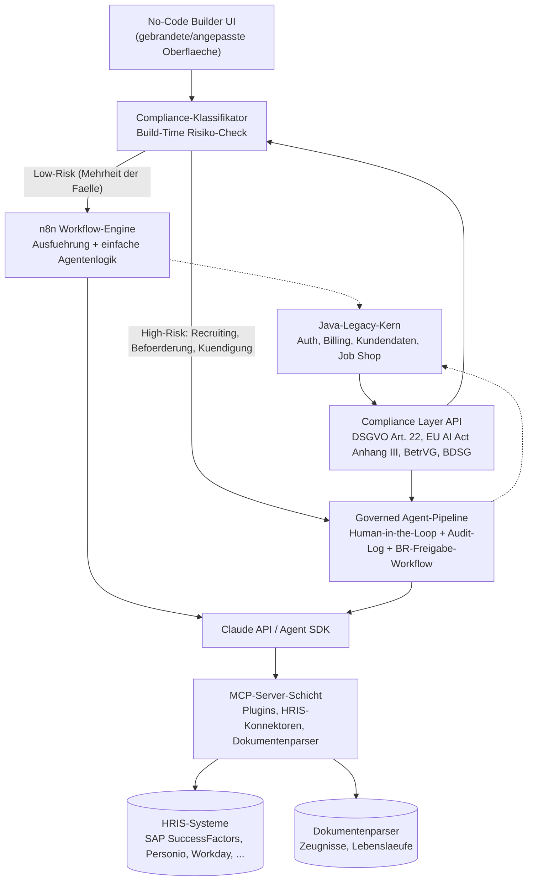

# Technologie-Hypothese

> Basis: research_technology.md, analysis_status_quo.md, research_market.md, research_problems.md
> Unternehmen: HRPerfect | Datum: 2026-09-01

**Hinweis zu den Eingabedateien:** Die Skript-Vorlage (`scripts/p3_hypothesis_technology.md`) sieht als dritte Quelle `hypothesis_solution.md` vor. Diese Datei existiert im Lauf `run_hrperfect_20260901` zum jetzigen Zeitpunkt noch nicht (vermutlich paralleler Lauf des Solution-Hypothesis-Agenten). Gemäß expliziter Auftragsvorgabe wurden stattdessen `research_market.md` und `research_problems.md` zusätzlich zu `research_technology.md` und `analysis_status_quo.md` gelesen. Der Case wurde aus `/private/tmp/.../scratchpad/hrperfect.yaml` gelesen (nicht `input/input.yaml`); `context/` wurde weisungsgemäß ignoriert (beschreibt einen anderen Case, "NeoEmployee").

---

## 1. Architektur-Optionen

### Option A: n8n-natives Builder-Modell

n8n übernimmt sowohl die Workflow-Ausführung als auch die Rolle der No-Code-Oberfläche für HR-Anwender:innen (direkt oder als gebrandete Editor-Instanz). Der Java-Legacy-Kern liefert Kundendaten, Billing und die Compliance-Layer-Inhalte über eine neue API-Schicht, die n8n-Workflows als Wissens-/Regel-Nachschlagewerk aufrufen. Claude API wird aus n8n-Knoten heraus angesprochen. MCP-Server dienen als Integrations-/Plugin-Mechanismus für HRIS-Systeme und Dokumentenparser.

- **Pro:** Schnellster Weg zum ersten Spike, da n8n im Case bereits als Orchestrierungsschicht gesetzt ist (tech_stack). Kein zusätzlicher Aufbau einer Agenten-Engine nötig. Kann auf den bestehenden n8n-Community-Node-Markt für Automatisierung zurückgreifen.
- **Contra:** n8n ist laut Recherche "primär ein visuelles Workflow-/Automatisierungstool, kein Agent-Framework im Sinne von LangGraph" — ob es für mehrstufige, bedingte HR-Agentenlogik ausreicht, ist eine explizite Recherchelücke (research_technology.md §1b, §2). Die Compliance-Schicht bleibt in diesem Modell reines Nachschlagewerk, nicht erzwungenes Gate — die BetrVG-Mitbestimmungsfrage (analysis_status_quo.md §4, Punkt 2) wird architektonisch nicht adressiert. Eine offen als n8n-Canvas erkennbare Oberfläche ist zudem näher am "vibe-codebaren" Commodity-Ende, das die Recherche als schwache Verteidigungslinie einstuft (research_technology.md §4).

### Option B: Eigener Agent-Runtime-Layer, n8n auf Glue-Rolle reduziert

Eine neue, in Python gebaute Agenten-Orchestrierungsschicht (LangGraph-Muster oder eigenes State-Machine-Design auf Basis des Claude Agent SDK) übernimmt die eigentliche Agentenausführung. n8n wird auf einfache Automatisierung/Trigger/HRIS-Sync zurückgestuft — seine dokumentierte Stärke. Eine vollständig eigene No-Code-Oberfläche kompiliert Nutzerkonfigurationen zu Agentendefinitionen für die neue Runtime herunter.

- **Pro:** Passt laut Recherche am besten zu zustandsbehafteten, produktionskritischen, compliance-schweren Workloads — LangGraph wird explizit als stärkste Eignung "für zustandsbehaftete, produktionskritische Systeme mit Compliance-Anforderungen" genannt (research_technology.md §1b). Eine proprietäre Runtime plus eigene Builder-Oberfläche ist in einem Wochenende deutlich schwerer nachzubauen als ein offen erkennbares n8n-Canvas.
- **Contra:** Erfordert den Aufbau und Betrieb einer vollständig neuen, nicht-trivialen Komponente zusätzlich zu n8n, das im Stack bereits als "neu" markiert ist — für ein 70-Personen-Unternehmen mit "primär Java (Legacy-Plattform)"-Team (Case-Beschreibung) ist das der größte Zuwachs an neuem technischem Terrain. Stellt zudem implizit die ursprüngliche n8n-Entscheidung infrage, ohne dass die Recherche einen Grund liefert, warum n8n verworfen werden sollte. Langsamster Weg zum ersten Spike der drei Optionen.

### Option C: Hybrid — n8n-Basispfad mit gegatetem High-Risk-Pfad

Ein Compliance-Klassifikator prüft beim Speichern/Aktivieren einer Agentenkonfiguration, ob sie unter die EU-AI-Act-Annex-III-Hochrisiko-Kategorien fällt (Recruiting/Selektion, Beförderungs-/Kündigungsunterstützung — research_technology.md §6). Niedrig-Risiko-Fälle (die Mehrheit, z. B. Urlaubs-/Reisekosten-Policy-Q&A nach DACH-Praxisbeispiel, research_problems.md §2.3) laufen über den n8n-Basispfad mit voller "15-Minuten-Demo"-Geschwindigkeit. Hochrisiko-Fälle werden in eine separate, kleinere Governed-Pipeline geroutet: verpflichtendes Human-in-the-Loop-Gate, vollständiges Logging, Freigabe-Workflow, der eine Betriebsvereinbarungs-Dokumentation erzwingt, bevor der Agent live geschaltet werden kann. Die Compliance Layer API speist sowohl den Klassifikator als auch die Governed-Pipeline inhaltlich.

- **Pro:** Übersetzt den in der Statusanalyse als "am klarsten offenen Winkel" benannten Punkt — ein "BetrVG-Mitbestimmungs-Gate im Produkt selbst", das laut Recherche bei keinem geprüften Wettbewerber gefunden wurde (analysis_status_quo.md §5, Punkt 2) — von einer Positionierungsbehauptung in eine tatsächliche Architekturkomponente. Beantwortet damit direkt die in der Statusanalyse offen gelassene Frage 2 ("Übersteht die 15-Minuten-Demo-Geschwindigkeit den Kontakt mit der BetrVG-Mitbestimmungspflicht?"): Ja, für die Mehrheit der Fälle, mit expliziter, bewusster Verlangsamung für die Minderheit. Verlagert die technische Verteidigungstiefe dorthin, wo laut Recherche kein Marktäquivalent existiert (Compliance-Wissen + dessen Durchsetzung), statt in die ohnehin commodity-artige Builder-Oberfläche.
- **Contra:** Komplexeste der drei Optionen — kombiniert den n8n-Pfad, eine zusätzliche (wenn auch kleinere) Governed-Pipeline und einen neuen Klassifikator, der selbst ein Fehlklassifikations-Risiko trägt (siehe Abschnitt 4). Höchster Gesamtbauaufwand. Löst die n8n-Eignungsfrage aus Option A nicht auf, sondern baut auf ihr auf.

---

## 2. Empfohlene Architektur

**Wahl:** Option C — Hybrid mit gegatetem High-Risk-Pfad.

**Begründung:** Der Case setzt n8n bereits als Orchestrierungsschicht ("new" im tech_stack) — das ist damit keine im Rahmen dieser Hypothese neu zu verhandelnde Entscheidung, sondern eine gegebene Randbedingung. Option B stellt diese Entscheidung faktisch infrage und verlangt zusätzlich den vollständigen Aufbau einer zweiten Orchestrierungsschicht — für ein Java-Legacy-Team, das mit n8n, Python und MCP bereits mehrere neue Technologiebereiche gleichzeitig aufnimmt, ist das der am wenigsten realistische Pfad. Option A ist am schnellsten umsetzbar, lässt aber genau die Komponente unbearbeitet, die laut Statusanalyse den einzigen bei keinem Wettbewerber gefundenen Differenzierungswinkel darstellt (das BetrVG-Gate) — Compliance bliebe Wissen statt Durchsetzungsmechanismus. Option C nutzt den n8n-Grundentscheid weiter, hält den Zusatzaufwand auf den tatsächlich neuen Teil begrenzt (Klassifikator + kleinere Governed-Pipeline für die Minderheit der Fälle, nicht für alle), und macht aus der Compliance-Layer-These erstmals eine überprüfbare technische Architekturentscheidung statt einer Behauptung.

**Skill-Gap-Hinweis (Pflichtangabe laut Auftrag):** Auch die reduzierte Zusatzkomponente in Option C (Klassifikator-Logik, kleinere Python-basierte Governed-Pipeline) verlangt Fähigkeiten, die über n8n-Konfiguration hinausgehen und im Case-Profil nicht belegt sind — das Unternehmen wird als "primär Java (Legacy-Plattform)" beschrieben, n8n, Python für Claude-API/MCP-Integration und jetzt zusätzlich ein Klassifikator/Gate-Mechanismus sind alle "neu". Keine der vier gelesenen Recherche-/Analysedateien kann eine Aussage über die tatsächliche interne Teamfähigkeit treffen (analysis_status_quo.md §2, "Skill-Gap-Risiko" — explizit als nicht durch Recherche prüfbar markiert). Dies bleibt eine ungeklärte, aber entscheidungsrelevante Voraussetzung für die hier empfohlene Architektur.

*(Hinweis: Umlaute in Diagramm-Knotentexten sind aus Kompatibilitätsgründen mit manchen Mermaid-Renderern als "ae/oe/ue" geschrieben; Fließtext in diesem Dokument verwendet durchgehend korrekte deutsche Umlaute gemäß Vorgabe.)*

---

## 3. Build-vs.-Buy-Aufschlüsselung

| Komponente | Ansatz | Konkretes Tool/API | Aufwand |
|---|---|---|---|
| LLM-Kernschicht (Reasoning, Textgenerierung) | Buy | Claude API — Sonnet 5 als Standardmodell, Haiku 4.5 für einfache/hochvolumige Calls, Opus 5 für komplexe Fälle; Claude Agent SDK für Tool-Orchestrierung | Niedrig (bereits im Stack gesetzt, laut Recherche produktionsreif) |
| Agent-Ausführung für Low-Risk-Workflows | Nutzen (bereits gesetzt) | n8n (Cloud oder Self-Hosted), erweitert um KI-Agent-Knoten | Mittel (n8n selbst gesetzt, aber Eignung für mehrstufige Agentenlogik laut Recherche ungeklärt — Prüfaufwand einkalkulieren, siehe Spike 1) |
| Governed-Pipeline für High-Risk-Fälle | Build | Kein direktes Marktäquivalent identifiziert; LangGraph als Architekturvorbild (nicht zwingend als übernommene Bibliothek) für zustandsbehaftete, auditierbare Abläufe | Hoch (neue Komponente, kein Bestandteil im aktuellen Stack, zusätzliche Python-Kompetenz nötig) |
| Compliance-Klassifikator (Build-Time-Risikoerkennung) | Build | Kein zukaufbares Äquivalent gefunden (research_technology.md §2); ggf. technische Hülle aus der Guardrail-/Policy-Engine-Kategorie (Galileo, Akto, Maxim AI) als Ausgangspunkt, Klassifikationslogik selbst ist Eigenleistung | Hoch (fachlich anspruchsvoll — Fehlklassifikation ist ein Compliance-Risiko, kein Bug; kein Präzedenzfall in der Recherche) |
| HR Competency Layer als API (Domänenwissen) | Build (laut Case größtenteils vorhanden) | HRPerfect-eigene Compliance-Layer-Infrastruktur, neu exponiert als API | Mittel–Hoch (Wissen laut Case vorhanden, API-Exponierung ist reine Eigenleistung; Aufwand in keiner der vier Dateien beziffert — Lücke) |
| No-Code-Builder-Oberfläche für HR-Anwender:innen | Build | Referenzmodelle zur Orientierung: Copilot Studio, Relevance AI, Lindy; keine Quelle zu White-Label-/Embed-Optionen für n8n-basierte Frontends gefunden | Hoch (UX-kritisch für die "Claude Code"-Analogie, technisch am wenigsten durch Recherche abgesichert — siehe Proof Point 5) |
| Plugin-/Marketplace-Ökosystem | Buy (Standard) + Build (Kuratierung) | MCP-Standard + öffentliches MCP-Registry als Basis; eigene Kuratierungs-/Freigabeschicht für Qualität und Compliance-Fit gelisteter Server | Niedrig für Protokoll-Übernahme, Mittel für Kuratierungsschicht |
| Dokumentenverarbeitung (Zeugnisse, Lebensläufe, Betriebsvereinbarungen) | Buy, mit Prüfvorbehalt | LlamaParse, LandingAI ADE oder Reducto (VLM-basiert) | Mittel (Integration vermutlich niedrig; Eignungsprüfung für deutsche Dokumentformate ist unerledigte Vorarbeit — research_technology.md §1e, Lücke) |
| HRIS-Integrationen/Konnektoren | Buy (iPaaS/HRIS-Middleware) | Kombo, Apideck, Truto (HR-spezialisiert) oder Workato, Boomi (generisch) für SAP SuccessFactors, Workday, Personio, BambooHR, ADP, HiBob | Mittel (reifer Markt, aber jede Integration bringt eigenes Auth-/Versions-/Feldschema mit, laufender Wartungsaufwand — research_technology.md §5) |
| DATEV-Anbindung (Lohn-/Gehaltsabrechnung, deutscher Mittelstand) | Ungeklärt | Note: nicht in research_technology.md abgedeckt — vor Priorisierung des Mittelstandssegments gezielt nachrecherchieren | Nicht bewertbar (expliziter blinder Fleck laut Recherche) |
| AI-Guardrails/Policy-Enforcement (technische Hülle, Gateway-Ebene) | Buy | Galileo, Akto, Maxim AI | Niedrig–Mittel (fragmentierter, aber produktionsreifer Markt ohne dominanten Standard) |
| EU-Datenresidenz-Alternative zur Claude-API (bei CLOUD-Act-Konflikt) | Buy (optionale Alternative) | Mistral AI oder Aleph Alpha/PhariaAI — beide laut Recherche produktionsreif mit voller EU-Datenresidenz | Hoch, falls nachträglich integriert (zusätzliche/parallele LLM-Schicht, im aktuellen Stack nicht vorgesehen — siehe Risiko 4) |

---

## 4. Top-Technologierisiken

| Risiko | Wahrscheinlichkeit | Schweregrad | Mitigation |
|---|---|---|---|
| **n8n reicht nicht für mehrstufige, zustandsbehaftete Agentenlogik.** n8n ist laut Recherche "primär ein visuelles Workflow-/Automatisierungstool, kein Agent-Framework im Sinne von LangGraph"; ob es bedingte, mehrstufige HR-Multi-Turn-Logik trägt, ist eine explizit offene Recherchelücke (research_technology.md §1b). | Mittel | Hoch | Spike 1 vor vollem Architektur-Commitment: nicht-trivialen, bedingten Use-Case direkt in n8n nachbauen. Bei Scheitern früh auf Ergänzung umsteuern — nicht erst nach Kundenauslieferung. |
| **Fehlklassifikation im Compliance-Gate** zwischen Low-Risk-Pfad (n8n) und High-Risk-Pfad (Governed Pipeline). Ein de facto Annex-III-pflichtiger Use Case (z. B. Bewerbungs-Screening) wird fälschlich als Low-Risk eingestuft und ohne Human-Oversight/Logging/BR-Dokumentation live geschaltet — ein Compliance-Verstoß, kein reiner Produktfehler. Kein Präzedenzfall für einen solchen Klassifikator in der Recherche gefunden. | Mittel | Hoch | "Fail-closed"-Kalibrierung (im Zweifel High-Risk statt Low-Risk), vollständiges Logging aller Klassifikator-Entscheidungen, kein technischer Bypass der Gate-Prüfung vor Live-Schaltung. Validierung an kuratiertem Testset (Proof Point 4). |
| **Kostenbasis für die Nutzungsgebühren-Architektur ist auf zwei Ebenen unkalkuliert.** (a) Kein Token-Verbrauchs-Benchmark pro typischem HR-Agenten-Case (research_technology.md §3) — Marge zwischen Nutzungsgebühr (Agentenzahl + Fallvolumen, nicht Token) und tatsächlichen Claude-API-Kosten unbekannt. (b) n8n-Preisstufen springen statt linear zu verlaufen (Starter 24 $/2.500 Ausführungen → Pro 60 $/10.000 → Business 800 $/40.000 → Enterprise berichtet 2.000–3.000 $+/Monat) — dieser Sprung steht im Spannungsverhältnis zum Case-Constraint einer glatten Preisskalierung vom 50-Personen-Betrieb bis zum Konzern. | Hoch | Hoch | Spike 2: Kosten-Benchmark über reale Cases inkl. Cache-Rabatt (90 %) und Batch-Rabatt (50 %). Parallel: n8n-Ausführungsvolumen pro Kundenplan modellieren und gegen die Preisstufen-Sprünge prüfen, bevor Endkundenpreise fixiert werden. |
| **US CLOUD Act vs. "DACH-native"-Kernversprechen.** Der gesetzte LLM-Layer (Claude API, Anthropic, USA) unterliegt laut mehreren recherchierten Quellen dem US CLOUD Act (research_technology.md §1f, §6) — ein Datenhoheits-Einwand, den sicherheitsbewusste Enterprise-Prospects im selben Procurement-Prozess vorbringen könnten, den die 600-Kunden-Basis eigentlich umgehen soll. | Mittel | Hoch | EU-souveräne Alternative (Mistral AI oder Aleph Alpha/PhariaAI, beide laut Recherche produktionsreif) als optionale Enterprise-Konfiguration frühzeitig prüfen — nicht erst, wenn ein konkreter Deal daran scheitert. |
| **Der No-Code-Builder selbst ist technologisch schwach verteidigbar.** "Vibe Coding" ermöglicht laut mehreren Quellen SaaS-Nachbauten binnen eines Wochenendes bis einer Woche (research_technology.md §4); der Case selbst berichtet bereits einen konkreten Präzedenzfall (Wiener Voice-AI-Plattform in einer Woche nachgebaut). | Hoch | Mittel | Ingenieursaufwand bewusst auf Compliance-Layer-API und Klassifikator/Gate konzentrieren (kein Marktäquivalent vorhanden), nicht auf die Builder-Oberfläche (Commodity-Kategorie) — ein UI-Nachbau allein liefert einem Nachahmer weder Compliance-Content noch die 600-Kunden-Distribution. |

---

## 5. Technische Meilensteine

1. **Spike 1 — n8n-Grenztest für mehrstufige HR-Agentenlogik.** Einen repräsentativen, nicht-trivialen HR-Use-Case (z. B. Zeugnis-Review mit bedingter Rückfrage bei Unklarheit und Verzweigung in zwei Folgeschritte je nach Ergebnis) rein in n8n + Claude API nachbauen. Ziel: die offene Recherchefrage beantworten, ob n8n allein für mehrstufige Agentenlogik ausreicht — vor vollem Commitment auf die empfohlene Architektur.

2. **Spike 2 — Claude-API-Kosten-Benchmark pro typischem Case.** Tatsächlichen Token-Verbrauch (Input/Output, mit/ohne Cache-Treffer) für 3–5 repräsentative HR-Agenten-Cases unterschiedlicher Komplexität messen (einfache Policy-Q&A bis komplexe Zeugnis-Analyse). Ziel: die fehlende Zahlenbasis (research_technology.md §3) schließen, um die Nutzungsgebühren-Kalkulation erstmals auf Marge zu prüfen.

3. **Spike 3 — Compliance Layer als lauffähige API (minimaler Ausschnitt).** Einen einzelnen, klar abgegrenzten Teil der bestehenden Compliance-Layer-Infrastruktur (z. B. nur die EU-AI-Act-Annex-III-Klassifikationslogik für Recruiting-Use-Cases) als aufrufbare API exponieren — als Machbarkeitsnachweis für die im Case vorausgesetzte, aber technisch noch nicht belegte Annahme "größtenteils vorhanden, muss nur API-fähig gemacht werden".

4. **Proof Point — Genauigkeit des Compliance-Klassifikators an einem kuratierten Testset.** Vor Produktivschaltung des Gate-Mechanismus: ein Testset aus mindestens 20–30 realistischen, von einer Fachperson (nicht dem Entwicklungsteam) als Low-/High-Risk gelabelten Beispiel-Agentenkonfigurationen zusammenstellen und den Klassifikator daran validieren — mit expliziter Nulltoleranz für "fail-open"-Fehler (fälschlich als Low-Risk eingestuft), nicht nur für Gesamtgenauigkeit.

5. **Proof Point — White-Label-/Embed-Fähigkeit der No-Code-Oberfläche.** Da keine Quelle bestätigt, ob und wie n8n als eingebettete, gebrandete Oberfläche für Endkund:innen nutzbar ist (research_technology.md §2, Lücke), früh klären, ob ein n8n-Editor-Fork/Embed technisch und lizenzrechtlich tragfähig ist — oder ob eine vollständige Eigenentwicklung der Nutzeroberfläche nötig wird. Hohe Hebelwirkung auf den Gesamtaufwand von Option C.
