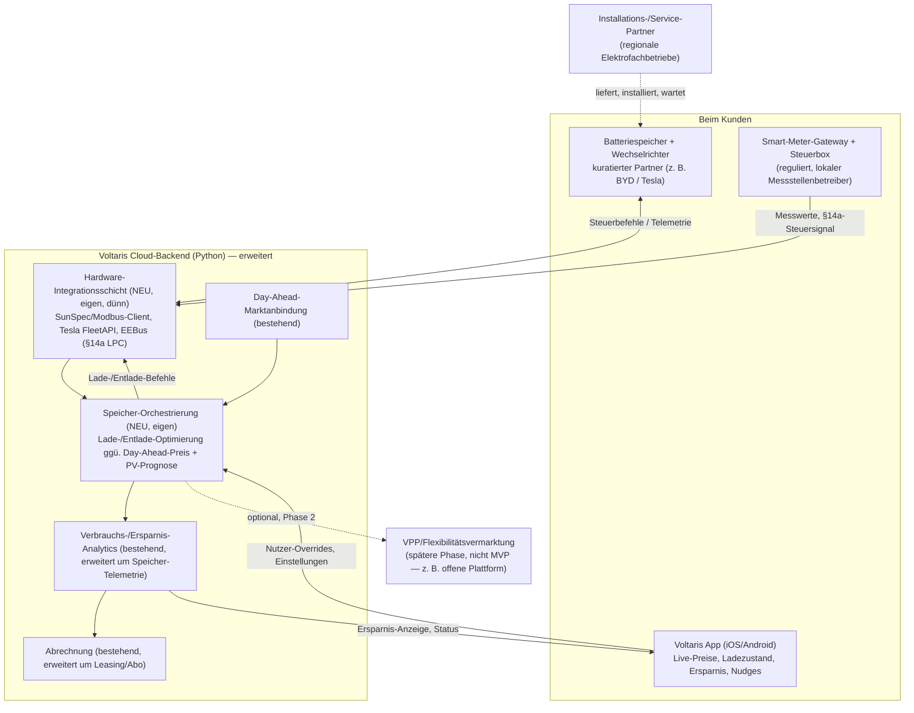

# Technology Hypothesis

> Based on: research_market.md, research_technology.md, research_problems.md, analysis_status_quo.md
> Company: Voltaris | Date: 2026-09-01

> **Hinweis zur Input-Basis:** Die Skript-Vorlage (`scripts/p3_hypothesis_technology.md`) nennt als Input `research_technology.md`, `analysis_status_quo.md` und `hypothesis_solution.md`. Der tatsächliche Auftrag für diesen Lauf verweist stattdessen auf `research_market.md`, `research_technology.md`, `research_problems.md` und `analysis_status_quo.md` — das deckt sich mit der Orchestrierung in `run.md` (Phase 3 läuft als drei parallele Agenten, die jeweils die Phase-1-Recherchen + `analysis_status_quo.md` lesen, nicht die Outputs der jeweils anderen Phase-3-Agenten). `hypothesis_solution.md` existierte zum Zeitpunkt dieses Laufs nicht und wurde nicht gelesen. Die Solution Direction wurde direkt aus `input/input.yaml` (`business_case.solution_direction`) entnommen. Dies ist die beste technologische Antwort auf Basis der Recherche — noch ohne Gegenperspektive; diese folgt in Phase 4 (Debatte).

---

## 1. Architecture Options

### Option A: Kuratierte Partner-Hardware mit dünner, eigener Integrationsschicht

**Kernkomponenten:** Voltaris wählt bewusst nur 2–3 Hardware-Partner (Speicher + Wechselrichter) mit stabilen, gut dokumentierten Schnittstellen aus — z. B. auf Basis von SunSpec/Modbus (offener Standard) und/oder einer offiziellen Hersteller-API wie Tesla FleetAPI. Voltaris baut selbst einen schlanken Integrations-/Adapter-Service im bestehenden Python-Backend, der Telemetrie normalisiert (Ladezustand, Leistung, PV-Erzeugung) und Steuerbefehle an die Hardware sendet. Die eigentliche Lade-/Entlade-Optimierungslogik (gegen Day-Ahead-Preis, PV-Prognose) bleibt vollständig Voltaris-eigene Entwicklung.

**Technologiewahl:** SunSpec Modbus, EEBus (für §14a-Anwendungsfälle), herstellerspezifische APIs (Tesla FleetAPI, sonnen Cloud-API) — jeweils nur für die kuratierten Partner.

**Pro:** Volle Kontrolle über die eigentliche Differenzierung (Optimierungsalgorithmus, Nutzenanzeige); keine laufenden Plattform-Lizenzgebühren, die die ohnehin unklare Marge belasten; kleine, beherrschbare Integrationsfläche statt "jede Marke"-Anspruch; passt zur in `analysis_status_quo.md` empfohlenen "enger gefassten Einstiegsstrategie".

**Contra:** Erfordert Aufbau echter Hardware-/Protokoll-Integrationskompetenz, die im Team laut `input.yaml` heute nicht vorhanden ist; Aufwand pro zusätzlichem Partner ist real (Kompatibilität ist laut Recherche "nicht automatisch gegeben", Nachrüstung von Schnittstellen "gelingt nicht immer"); Wartungslast bei API-Änderungen der Hersteller liegt bei Voltaris selbst.

### Option B: Lizenzierte, herstellerunabhängige Integrationsplattform (Build-on-Buy)

**Kernkomponenten:** Voltaris lizenziert bzw. partnert mit einer bestehenden herstellerunabhängigen HEMS-Integrationsschicht (z. B. gridX Xenon, Solar Manager oder Fenecon FEMS), die die Mehrmarken-Kompatibilität bereits gelöst hat. Voltaris baut nur eine dünne Brücke von dieser Plattform in die eigene App und ins Abrechnungssystem und konzentriert die eigene Entwicklungsarbeit auf App/Nudging/Nutzenanzeige — laut Recherche ohnehin die bestehende Kernkompetenz.

**Technologiewahl:** Herstellerunabhängige HEMS-Plattform als Integrations-Backbone; eigene Entwicklung beschränkt auf API-Bridge + Optimierungs-/Anzeigelogik obendrauf.

**Pro:** Deutlich geringerer Integrations-Engineering-Aufwand; schnellerer Weg zu "viele Marken unterstützt"; nutzt einen Markt, der laut Recherche bereits rund 9 Systeme umfasst, die PV-Optimierung UND dynamische Tarifsteuerung gleichzeitig beherrschen; passt zum Team-Profil (keine Hardware-Kompetenz im Haus).

**Contra:** Zusätzliche Abhängigkeits-/Lock-in-Ebene (Plattform-Vendor statt nur Hardware-Vendor); laufende Lizenzkosten pro Kunde/Einheit belasten eine Marge, deren Grundlage laut Recherche selbst unklar ist (Systempreise streuen um Faktor 3–4 zwischen Quellen); die eigentliche Optimierungslogik könnte teilweise in der fremden Plattform "eingebaut" sein statt in Voltaris' eigener Hand zu liegen, was die angestrebte Differenzierung verwässert; ob eine solche Plattform vollständig Voltaris-gebrandete Kundenerfahrung zulässt, ist ungeklärt.

### Option C: Open-Source-Fundament (evcc) als gehärtete Eigenentwicklung

**Kernkomponenten:** Voltaris nutzt das quelloffene Projekt `evcc` (MIT-Lizenz, GitHub `evcc-io/evcc`) als technische Basis für die Geräte-Integrationsschicht — es unterstützt laut Projektbeschreibung hunderte Wechselrichter/Speicher/Wallboxen, lokal-first, mit REST/MQTT-APIs. Voltaris betreibt eine eigene, gehärtete Version davon und baut kommerzielle Support-/Monitoring-/SLA-Schicht sowie App/Abrechnung obendrauf.

**Technologiewahl:** evcc als Kernbibliothek/Referenz; eigene Betriebs-, Support- und Sicherheitshärtung.

**Pro:** Keine Lizenzkosten; von Haus aus sehr breite Geräteunterstützung (deutlich mehr als 2–3 kuratierte Partner); lokal-first reduziert das Cloud-Abhängigkeitsrisiko, das bei einzelnen Herstellern (z. B. sonnen) besteht.

**Contra:** Die Recherche selbst ordnet evcc explizit als "eher Referenz-/Inspirationsquelle... als direkt einsetzbare Business-Plattform" für ein kommerzielles B2C-Geschäft mit Support-/Haftungsanforderungen ein (eigene Einschätzung der Recherche, nicht extern belegt, aber explizit so gekennzeichnet) — Voltaris würde die volle Härtungs-, Sicherheits- und Haftungsverantwortung für ein nicht für Business-SLAs konzipiertes Projekt übernehmen; erfordert mindestens so viel Integrationskompetenz wie Option A, aber ohne einen Hersteller, der Mitverantwortung trägt.

---

## 2. Recommended Architecture

**Wahl: Option A — Kuratierte Partner-Hardware mit dünner, eigener Integrationsschicht.**

**Begründung:**

1. **Kapitalrestriktion.** Laufende Plattform-Lizenzgebühren (Option B) belasten eine Stückkosten-Kalkulation, deren Grundlage laut Recherche selbst unsicher ist (Systempreise streuen um Faktor 3–4 zwischen Quellen). Ein kapitalbeschränktes Startup sollte diese zusätzliche Unsicherheitsebene nicht ohne Not einziehen.
2. **Markenkontrolle passt zum Constraint "schlanke Software-Marke darf nicht kippen".** `input.yaml` beschreibt die zentrale Software-Steuerung und die "Euro-Vorteil sichtbar machen"-Funktion als Kern des Nutzenversprechens — nicht als Nebensache. `analysis_status_quo.md` ordnet "Verbrauchs-/Nutzenanzeige, App, Nudging" explizit als bestehende Voltaris-Kernkompetenz (Build) ein, während "HEMS/Steuerungslogik" als "Buy/dünne eigene Integrationsschicht" eingestuft wird — das ist exakt Option A, nicht die volle Auslagerung an eine fremde Plattform (Option B) oder ein ungehärtetes OSS-Fundament (Option C).
3. **Die Integrationsfläche ist bei 2–3 kuratierten Partnern bewusst klein gehalten** — das unterscheidet Option A von "wir unterstützen jede Marke" (was laut Recherche technisch nicht trivial wäre) und macht den Aufbau der fehlenden Integrationskompetenz zu einem eingrenzbaren, nicht zu einem unbegrenzten Problem.
4. **Vermeidet das explizit von der Recherche benannte Eignungsrisiko von evcc** (Option C) für ein Geschäft mit Support-/Haftungsanforderungen.
5. **Passt zur strategischen Leitplanke aus `analysis_status_quo.md`** ("enger gefasste Einstiegsstrategie" statt volle Breite von Anfang an).

**Erforderliche Skills, die das Unternehmen laut `input.yaml` heute nicht hat:** Hardware-/Protokoll-Integrationsentwicklung (SunSpec/Modbus, EEBus, herstellerspezifische APIs), Partner-/Hardware-Beschaffungsmanagement. Das Team ist laut Case-Beschreibung auf Software/UX/Energiemarkt fokussiert, ohne Hardware- oder Installationskompetenz. **Dieser Skill-Aufbau (Einstellung oder externe Integrationsexperten) ist eine Voraussetzung für Option A, kein Nebeneffekt** — sollte als eigener Workstream parallel zum ersten technischen Spike (siehe Abschnitt 5) geplant werden. Sollte sich dieser Aufbau als zu langsam erweisen, ist Option B der nächstliegende Fallback (siehe Abschnitt 4, Risiko 1 und 3).

---

## 3. Build vs. Buy Breakdown

| Component | Approach | Specific Tool/API | Effort |
|---|---|---|---|
| Batteriespeicher (Zellen, BMS, Gehäuse) | Buy | Kuratierte Kurzliste, z. B. BYD Battery-Box (HVS/HVM), Tesla Powerwall 3, Huawei LUNA2000 — Auswahl nach API-Offenheit priorisieren, nicht nur nach Preis | Low |
| Wechselrichter/Hybrid-Inverter | Buy | An Speicherwahl gekoppelt: SMA, Fronius, SolarEdge (separat) oder integriert bei Tesla PW3/Huawei LUNA2000 | Low |
| Hardware-Integrationsschicht (Partner-Adapter) | Build (dünn, eigen) | SunSpec-Modbus-Client, Tesla FleetAPI, EEBus-Anbindung für §14a-Use-Case "LPC" (Vorbild: SMA Sunny Home Manager 2.0); evcc-Quellcode als technische Referenz, nicht als Plattform | Medium–High |
| Speicher-Orchestrierung / Optimierungslogik | Build | Eigenentwicklung im bestehenden Python-Backend, aufsetzend auf der bestehenden Day-Ahead-Marktanbindung | Medium–High |
| SMGW / Steuerbox / Messstellenbetrieb | Buy (reguliert, alternativlos) | BSI-TR-03109-zertifizierte SMGW-Hersteller; Zuständigkeit liegt beim jeweils lokalen Messstellenbetreiber, kein Voltaris-Einfluss auf Auswahl/Tempo | Low (kein Entwicklungsfeld — Abhängigkeit ist ein Risiko, kein Aufwandsposten) |
| App-Erweiterung (Ladezustand-/Ersparnis-Anzeige, Steuer-Overrides) | Build | Erweiterung der bestehenden Voltaris-App-Codebasis (iOS/Android) | Medium |
| Installation / Montage / Service | Partner | Regionale Elektrofachbetriebe / PV-Installateursnetzwerke — kein einzelner Anbietername aus der Recherche als Empfehlung ableitbar | Medium (operativ, kein Technologie-Build) |
| Finanzierung / Leasing / "Speicher-as-a-Service" | Buy/Partner | Marktvorbilder: Bnewable (Battery-as-a-Service), EWE, Yello, historisch Younicos; technisch als Erweiterung des bestehenden Abrechnungssystems umzusetzen | Medium |
| VPP / Flexibilitätsvermarktung | Buy/Partner — **explizit zurückgestellt, nicht Teil des MVP** | Marktvorbild: Kiwigrid (offene, herstellerunabhängige Plattform) als Alternative zu geschlossenen Ökosystemen (sonnenVPP, 1KOMMA5°). **Hinweis: nicht in der Recherche abgedeckt — verifizieren vor Übernahme:** Marktzugangsvoraussetzungen für einen neuen VPP-Aggregator wurden in `research_technology.md` explizit nicht recherchiert (offene Lücke) | Low für MVP (bewusst nicht gebaut) |

---

## 4. Top Technical Risks

| Risk | Likelihood | Severity | Mitigation |
|---|---|---|---|
| **Heterogene Hardware-Partner-APIs:** Kompatibilität zwischen Speicher und Wechselrichter ist auch bei offenen Standards (SunSpec, EEBus) laut Recherche "nicht automatisch gegeben"; Nachrüstung von Schnittstellen "gelingt nicht immer". Konkret: eine gewählte Speicher-Wechselrichter-Kombination könnte nicht die Steuerungstiefe (Echtzeit-Lade-/Entlade-Override) bieten, die die Orchestrierungslogik braucht. | Hoch | Hoch | Strikt kuratierte Partnerliste (2–3 Hersteller) statt "jede Marke"-Versprechen; API-Tiefe vor Vertragsabschluss technisch verifizieren (nicht nur Datenblatt); dedizierte Integrationstestsuite pro Partner-Kombination vor Rollout |
| **Cloud-Abhängigkeit einzelner Hersteller-APIs:** sonnen bietet laut Recherche nur eingeschränkten lokalen Zugriff, Steuerung läuft überwiegend über eine Cloud-API. Bei Internetausfall beim Kunden oder Störung der Hersteller-Cloud kann weder gesteuert noch die App-Ersparnisanzeige aktualisiert werden. | Mittel | Mittel–Hoch | Partnerauswahlkriterium "lokale Steuerbarkeit ohne zwingenden Cloud-Roundtrip" (SunSpec/Modbus lokal, EEBus) priorisieren; Graceful Degradation in der App (letzter bekannter Zustand + Störungshinweis statt Fehlerbild) |
| **Unbekannte Kompatibilität Python-Backend ↔ Partner-APIs/HEMS-Plattformen:** explizite Recherchelücke laut `research_technology.md` — unternehmensinterne Architekturfrage, öffentlich nicht recherchierbar. | Unbekannt | Potenziell Hoch (blockierend für die gesamte Architektur bei grundlegender Inkompatibilität) | Erster technischer Spike (siehe Abschnitt 5) klärt dies vor jeder Partner-Vertragsentscheidung |
| **SMGW-/§14a-Rollout-Abhängigkeit:** nur 5,5 % aller Zählpunkte (23,3 % der Pflichtfälle) hatten Ende 2025 ein intelligentes Messsystem; Rollout-Tempo hängt vom jeweils zuständigen lokalen Messstellenbetreiber ab. Für Nicht-PV-Kunden mit Netzbezug über 4,2 kW ist volle §14a-Steuerbarkeit ohne iMSys nicht erreichbar. | Hoch (bereits eingetreten und quantifiziert) | Mittel–Hoch (begrenzt Funktionsumfang/Rollout-Tempo, nicht die PV-Kernfunktion) | Architektur so gestalten, dass PV-Eigenverbrauchsoptimierung — funktioniert unabhängig von iMSys — der Launch-Kernnutzen ist; §14a-Vorteile als automatisch mitwachsenden Zusatznutzen behandeln, nicht als Launch-Voraussetzung |
| **Hersteller-Ausfall-/Garantie-Diskontinuität** als Risiko für das "Einrichten-und-vergessen"-Versprechen: Präzedenzfälle bereits im Markt (Varta-Insolvenz 2025, sonnen musste Garantiebedingungen nach Gerichtsurteil überarbeiten, Growatt-Kritik wegen Garantieverweigerung). Fällt ein Hardware-Partner aus, steuert Voltaris' Software technisch gegen Hardware ohne Herstellersupport im Rücken. | Mittel (mehrere Präzedenzfälle im Gesamtmarkt, noch nicht bei den konkret kuratierten Partnern selbst) | Hoch (trifft das Kernversprechen genau bei den vertrauensvollsten Kunden) | Vertragliche Absicherung/Exit-Klauseln mit Hardware-Partnern prüfen. **Hinweis: nicht in der Recherche abgedeckt — verifizieren vor Übernahme:** Kein am Markt verfügbares Standardprodukt für Garantiekontinuität (z. B. Versicherungslösung) wurde in `research_market.md` identifiziert — eine vertragliche/versicherungsbasierte Absicherung ist ein eigener Vorschlag dieser Hypothese, keine recherchierte Marktlösung |

**Zusätzliche regulatorische Randbedingung (kein Kern-Technologierisiko, aber mit Architektur-Implikation):** Ob die Lade-/Entlade-Optimierungslogik unter eine höhere Risikoklasse des EU AI Act fällt, ist laut `research_technology.md` ungeklärt — dort ausdrücklich als unbelegte eigene Einschätzung markiert, keine Quelle gefunden. Vor Rollout juristisch prüfen; falls eine höhere Risikoklasse zutrifft, könnten zusätzliche Logging-/Erklärbarkeits-Komponenten in der Orchestrierungsschicht nötig werden.

---

## 5. Technical Milestones

1. **Technischer Kompatibilitäts-Spike (erster Prototyp).** Anbindung des bestehenden Python-Backends an einen einzigen Referenz-Hardware-Partner (z. B. über SunSpec/Modbus lokal oder Tesla FleetAPI). Nachweis, dass Telemetrie (Ladezustand, Leistung) gelesen und ein Lade-/Entlade-Befehl gesendet werden kann. Erfolgskriterium: stabiler, wiederholbarer Steuerzyklus über mehrere vollständige Lade-/Entlade-Durchläufe, inklusive mindestens eines simulierten Verbindungsabbruchs mit sauberem Wiederaufbau — ohne manuelles Eingreifen. Dieser Spike beantwortet die wichtigste offene technische Unbekannte (Risiko 3, Abschnitt 4) und sollte vor jeder Partner-Vertragsentscheidung stehen.

2. **Optimierungslogik-Prototyp gegen echte Voltaris-Daten.** Regelbasierter (kein ML-)Lade-/Entlade-Algorithmus gegen historische Day-Ahead-Preisdaten aus der bestehenden Marktanbindung, angewendet auf mehrere reale Voltaris-Verbrauchsprofile (mit und ohne PV). Ziel: die im Case offene Frage 1 ("Was ermöglicht ein Speicher wirklich, gerade ohne PV?") mit eigenen Daten beantworten statt mit den stark streuenden Sekundärquellen-Schätzungen aus der Recherche (17–160 €/Jahr ohne PV, je nach Quelle). Erfolgskriterium: belastbare, unternehmenseigene Ersparnis-Bandbreite je Kundensegment.

3. **Zweite Partner-Integration zur Generalisierungsprobe.** Anbindung eines zweiten, technisch andersartigen Hardware-Partners (z. B. modulares System statt All-in-One), um zu verifizieren, dass die Integrationsschicht als wiederverwendbares Muster gebaut wurde und nicht fest auf den ersten Partner zugeschnitten ist. Erfolgskriterium: die zweite Integration benötigt spürbar weniger Anpassungsaufwand als die erste (qualitativer Vergleich, keine Zeitschätzung).

4. **Kleiner Feldpilot mit echten Bestandskunden.** End-to-End-Test inklusive Installation durch einen Service-Partner, App-Anzeige und Abrechnungsintegration bei einer kleinen Kohorte von PV-Bestandskunden (Zielsegment gemäß ICP-Empfehlung in `analysis_status_quo.md`). Pilotumfang nicht kalendarisch, sondern über ein Abdeckungskriterium festgelegt: mindestens ein vollständiger Abrechnungszyklus plus ausreichende Streuung unterschiedlicher Wetter-/Verbrauchssituationen, um die Ersparnis-Anzeige realistisch zu validieren. Erfolgskriterium: Betriebs- und Supportlast bleibt beherrschbar (Bezug zum dokumentierten Fenecon-Warnsignal aus `research_problems.md`).

5. **§14a-/SMGW-Steuerbarkeitsnachweis.** Sobald mindestens ein Pilotkunde über ein intelligentes Messsystem verfügt: End-to-End-Nachweis der Steuerbox-Anbindung (EEBus-Anwendungsfall "LPC" oder vergleichbar). Da dies laut aktuellen Rollout-Zahlen nur einen kleinen Teil der frühen Kundenbasis betrifft, ist dieser Meilenstein kein Launch-Blocker, sondern ein Proof-Point für den regulatorisch geförderten Zusatznutzen (110–200 €/Jahr reduziertes Netzentgelt).
